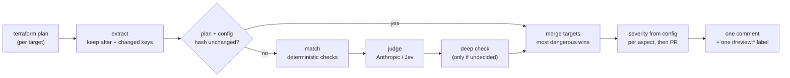

# tfreview

tfreview checks a Terraform plan against risks you define and reports the
verdict on a pull request as one comment and one `tfreview:*` label.

## How it reviews



Only the plan is read, and `before` values never leave the runner. Details are
in [How tfreview works](docs/how-it-works.md).

## Why tfreview

- **Whole-repo AI reviewers re-read everything every time.** They spend tokens
  on every push and take criteria only as free-form prompt text. tfreview reads
  only the plan, caches verdicts per target by the hash of plan + config, and
  re-judges only what changed. Criteria are structured YAML checks, so each
  aspect is configured on its own.
- **Your team's rules differ: strict here, relaxed there.** Each check has a
  severity set in `.tfreview.yaml`. Deterministic checks (`match`) and judged
  checks (`instructions`) combine freely; the LLM only says hit / miss.
- **Reviews should not block merges.** By default tfreview only reports. With
  `approve: true` it approves the PR when every check is clear, so humans look
  only at what is flagged. `--fail-on critical` makes it a required check
  instead.
- **Review results vary from run to run.** The same plan and config give the
  same verdicts, and one comment (replaced in place) plus one `tfreview:*`
  label carry the result. Monorepos and multi-environment layouts are judged
  together; the most dangerous target wins.
- **Rules should come from past mistakes.** The `tfreview-rules` skill mines a
  repository's failed applies, reverts, and fix-up PRs and turns them into
  checkpoints per resource type.

`tfreview fetch --pr N` pulls the plan CI already produced, so you (or your AI
agent) can get the same verdict from a laptop.

> **Status:** alpha. Breaking changes may occur before v1.

## Install

Download a binary from [Releases](https://github.com/nakamasato/tfreview/releases),
or install with Go:

```sh
go install github.com/nakamasato/tfreview/cmd/tfreview@latest
```

## Quick start

Create a Terraform plan JSON, reduce it, and review it locally:

```sh
terraform show -json tfplan > plan.json
tfreview extract --show-json plan.json --target default --out default.json
tfreview review --plan default.json
```

To review pull requests in CI, add the
[GitHub Action](https://github.com/nakamasato/tfreview) to a workflow and
provide an LLM API key. The action can also fail a check at a chosen severity.

## Docs

- [GitHub Actions and CLI usage](docs/usage.md)
- [Configuration and checks](docs/configuration.md)
- [How verdicts and incremental state work](docs/how-it-works.md)
- [Evaluation and limitations](docs/limitations.md)

MIT License. See [LICENSE](LICENSE).
