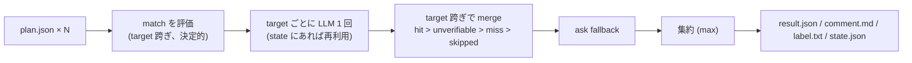

# tfreview — design

`terraform plan` の結果だけを入力に、PR が本番に何をするかを観点ごとに判定して PR に掲示する
CLI と、それを呼ぶ GitHub Action。

## 決定事項

| 論点 | 決定 |
| --- | --- |
| 提供形態 | CLI が正。GitHub Action は CLI を呼ぶ composite |
| plan 実行 | 含めない。`terraform show -json` の出力を受け取るだけ |
| 言語 | Go 単一バイナリ。module path `github.com/nakamasato/tfreview` |
| 出力言語 | 英語既定。config `language:` でコメント文言と LLM への指示言語を切り替え |
| LLM | v1 は Anthropic Messages API のみ。`Provider` interface を切り、後から追加できる |
| 複数 plan | 1 つでも N 個でも受ける。内部モデルは N 前提 |
| 単位の呼び名 | **target**（1 回の `terraform plan` の単位） |
| 観点 | プロバイダ不問の汎用デフォルトを組み込み + `examples/` に AWS / GCP の完全例 |
| PR 反映 | CLI の `comment` サブコマンド。Action もローカルも同じコマンドを呼ぶ |
| plan 入手（ローカル） | `fetch` サブコマンドが Action の上げた artifact を読む。自前 plan 実行はエージェント側の責務（v1 では同梱物なし） |
| 増分判定 | v1 に入れる。CLI は state ファイルの読み書きだけ、保管は Action の責務 |
| ブロック | `--fail-on <level>`。既定は落とさない |
| ラベル | `tfreview:none` / `tfreview:medium` / `tfreview:high` / `tfreview:critical` / `tfreview:unknown` |
| ライセンス | MIT |

## 1. 全体像

```
terraform show -json ──▶ tfreview extract ──▶ plan.json (絞ったもの、target 名付き)
                                                  │
    .tfreview.yaml ───────────────────────────────┤
    state.json (前回) ────────────────────────────┤
                                                  ▼
                                          tfreview review ──▶ result.json / comment.md / label.txt / state.json
                                                  │
                                                  ▼
                                          tfreview comment --pr N   (upsert + ラベル)

tfreview fetch --pr N ──▶ plan.json 群  (Action が上げた artifact から取得)
```

コマンド間は JSON ファイルで受け渡す。各コマンドは単体で実行・テストできる。

### サブコマンド

| コマンド | 入力 | 出力 | 外部依存 |
| --- | --- | --- | --- |
| `extract` | `--show-json FILE\|-`（`terraform show -json` の出力）, `--target NAME`, `--out FILE` | plan.json | なし |
| `review` | `--plan FILE`（複数可）, `--config FILE`, `--state-in FILE`, `--out-dir DIR`, `--head-sha`, `--repo owner/name`, `--fail-on LEVEL`, `--fail-on-machine-only` | `DIR/result.json`, `DIR/comment.md`, `DIR/label.txt`, `DIR/state.json` | LLM API |
| `comment` | `--result FILE`, `--pr N`, `--repo owner/name` | PR コメント upsert、`tfreview:*` ラベル付け替え | GitHub API |
| `fetch` | `--pr N`, `--repo owner/name`, `--out-dir DIR` | plan.json 群 | GitHub API |

`review` の exit code: 0 = 正常、1 = `--fail-on` 条件に該当、2 = config 不正・入力不正。
LLM の失敗は exit code に反映しない（判定不完全としてコメントに出す）。

### `extract` が残すもの

`address` / `type` / `name` / `module_address` / `provider_name` / `actions` / `after`
（`after_sensitive` が立っていない範囲）と、update / replace のときだけ `changed_keys`
（この PR で値が変わった属性名）。**`before` の値は載せない。** target ごとの
add / change / destroy / replace / import の件数を `counts` に持つ。

```json
{
  "target": "aws-prd",
  "counts": {"add": 1, "change": 2, "destroy": 0, "replace": 0, "import": 0},
  "resources": [
    {
      "address": "aws_s3_bucket.logs",
      "type": "aws_s3_bucket",
      "name": "logs",
      "module_address": "",
      "provider_name": "registry.terraform.io/hashicorp/aws",
      "actions": ["update"],
      "after": {"bucket": "logs", "force_destroy": true},
      "changed_keys": ["force_destroy"]
    }
  ]
}
```

## 2. Config（`.tfreview.yaml`）

```yaml
language: en                 # 既定 en。コメントの固定文言と LLM への指示言語
llm:
  provider: anthropic        # v1 は anthropic のみ
  model: claude-opus-5
  max_plan_chars: 100000     # 超えたら API を呼ばず全チェック unverifiable
  pricing:                   # USD / Mtok。フッターの概算にだけ使う。省略時は組み込み値
    input: 5.00
    cache_write: 6.25
    cache_read: 0.50
    output: 25.00
categories:
  - id: destruction
    title: Destruction / downtime
    checks:
      - id: delete-or-replace
        level: critical                    # none < medium < high < critical
        match: { actions: [delete] }       # actions / types / targets のみ。値は文字列 list
        verdict_on_match: ask              # hit(既定) / ask / unverifiable
        question: |
          ...
```

- `categories` が無ければ組み込みの汎用デフォルトを使う。書けば丸ごと置き換え
- `id` は category / check とも一意。重複・`level` 不正・`match` の未知キー・`question` と
  `match` の両方が無いチェックは ConfigError（exit 2）
- config の SHA-256 を digest として state のキーに混ぜる

### チェックの型

| 型 | config | 判定するもの | LLM |
| --- | --- | --- | --- |
| A. 事実 | `match`（`verdict_on_match: hit`） | plan に出る事実 | 使わない |
| B. 解釈 | `question` のみ | plan に出るが解釈が要る | 使う |
| B′. 事実 + 解釈 | `match` + `question` + `verdict_on_match: ask` | 何が変わるかは決定的、危険かは解釈 | 使う。答えが得られなければ match の結果に戻る |
| C. 検証不能 | `match` + `verdict_on_match: unverifiable` | plan に原理的に出ない | 使わない。「plan では検証不能」を出す |

`level` は必ず config が決める。LLM は該当・非該当と理由だけを返す。

### レベルの定義

軸は復旧可能性と本番への影響。

| level | 基準 |
| --- | --- |
| `critical` | 元に戻せない、または本番が止まる |
| `high` | 戻せるが、気づかないまま被害が続きうる |
| `medium` | 戻せて、影響が閉じている |
| `none` | 該当なし |

### 組み込みデフォルト観点

プロバイダに依存しない範囲で持つ。

| category | check | 型 | level |
| --- | --- | --- | --- |
| destruction | delete-or-replace | B′（`actions: [delete]` + ask） | critical |
| data-loss | stateful-delete | A（`actions: [delete]` + 主要な DB / ストレージ型の types） | critical |
| data-loss | guard-relaxed | B（force_destroy / deletion_protection 等が緩む） | critical |
| exposure | privilege-grant | B（権限の拡大・ワイルドカード） | high |
| exposure | public-exposure | B（0.0.0.0/0、public access） | high |
| cost | recurring-charge | B（継続課金の増加） | high |

`examples/aws.yaml` / `examples/gcp.yaml` にプロバイダ固有の観点を含む完全例を置く。

## 3. 判定の流れ（`review`）



1. plan が 0 個 → 「評価していない」旨のコメント、`tfreview:none`、LLM は呼ばない
2. 全 target で resources が空 → 差分なしコメント、`tfreview:none`、LLM は呼ばない
3. `match` を全チェック・全 target で評価。決定的でコストゼロなので毎回ゼロから
   - `hit` / `unverifiable` は確定
   - `ask` は候補があるときだけ LLM に回し、match の結果を fallback として控える
4. target ごとに `(plan digest, config digest)` で state を引く。あれば再利用、なければ
   LLM に未確定チェックの question をまとめて 1 回で問う
5. 同じチェックの target 跨ぎ merge: 危険な方を残す。負けた側が `unverifiable` /
   `skipped` だった事実は勝者の reason に短く残す
6. `ask` fallback: 1 target でも答えが欠けたら match の結果に戻す（max merge で `miss` が
   欠けた側を押し切るのを防ぐ）。戻したものは確定判定として扱う
7. 集約: 観点のスコア = 配下チェックの max、PR のスコア = 観点の max
8. `skipped` が 1 つでもあれば見出しは「判定不完全」、ラベルは `tfreview:unknown`
9. `--fail-on LEVEL`: PR スコアが LEVEL 以上なら exit 1。`--fail-on-machine-only` のときは
   match 由来の `hit`（A 型、または ask fallback）だけを対象にする。`unknown` は落とさない

### 増分判定（state）

```json
{
  "head_sha": "abc123",
  "config_digest": "sha256:...",
  "targets": {
    "aws-prd": {
      "plan_digest": "sha256:...",
      "verdicts": [{"check_id": "...", "verdict": "hit", "reason": "..."}]
    }
  }
}
```

- キーは「絞った plan JSON + config」の SHA-256、粒度は target
- `match` はキャッシュしない
- `skipped` を含む target は state に書かない（一時障害を PR の寿命のあいだ固定しない）
- `--state-in` が無い・壊れている場合は無視して全 target を判定する

## 4. LLM 呼び出し

- `Provider` interface: `Judge(ctx, plan, checks, language) ([]Verdict, Usage, error)`
- target ごとに Messages API を **1 回**。エージェントループなし、ツールなし
- 入力: system（役割と制約: plan に無いことを推測しない、判断できなければ unverifiable、
  reason にはリソースを含める）+ user（target 名、plan JSON、question 一覧）
- 応答は tool_use による構造化出力: `{verdicts: [{check_id, verdict: hit|miss|unverifiable, reason}]}`。
  返ってこなかった check は `skipped`
- system + plan に prompt caching
- plan が `max_plan_chars` を超えたら呼ばずに全チェック `unverifiable`（reason に容量超過を明記）
- API エラー・タイムアウト・パース失敗 → その target の全チェック `skipped`。プロセスは落とさない
- `Usage` に呼び出し回数・input / cache_write / cache_read / output トークンを溜め、フッターに
  model・回数・トークン・概算コストを出す。LLM を呼ばなかった run では出さない
- `mock` Provider をテスト用に同梱（固定の verdict を返す / エラーを返す）

## 5. 出力

### `comment.md`

上から:

| 段 | 中身 |
| --- | --- |
| マーカー | `<!-- tfreview:begin -->` … `<!-- tfreview:end -->` |
| 見出し | `## 🔴 Risk: critical — Destruction / downtime`。テキストだけで危険度が読める |
| バッジ | 全体 1 枚 + 観点ごとの `該当/総数`（shields.io）。見出しの重複で、消えても困らない |
| メタ | 判定した commit（短縮 SHA、リンク）と判定時刻（`<relative-time>`） |
| 表 | 観点ごとのスコア、details にチェックごとの verdict と reason（🔧 plan の事実 / 🤖 LLM の判断） |
| target 表 | target ごとの add / change / destroy / replace / import、再利用したか再判定したか |
| 正本リンク | config ファイルへのリンク（判定した commit の blob） |
| フッター | LLM を呼んだ run だけ: model・呼び出し回数・トークン・概算コスト |

### `result.json`

コメントの元データ。`score`, `incomplete`, `label`, `categories[].checks[].{verdict, reason, source: machine|llm}`,
`targets[].counts`, `usage`。`comment` サブコマンドと外部ツールはこれを読む。

### `label.txt`

`tfreview:<score>` または `tfreview:unknown`。1 行。

## 6. `comment` / `fetch`

- `comment`: PR のコメント一覧からマーカーを含む自分のコメントを探し、あれば PATCH、なければ
  POST。`tfreview:*` ラベルを全部外して 1 枚付ける。ラベルが無ければレベル別の色で作る
  （作れなければ警告してコメントだけ出す）。`tfreview:` は専有名前空間

  | ラベル | 色 |
  | --- | --- |
  | `tfreview:none` | 緑 `0E8A16` |
  | `tfreview:medium` | 黄 `FBCA04` |
  | `tfreview:high` | 橙 `D93F0B` |
  | `tfreview:critical` | 赤 `B60205` |
  | `tfreview:unknown` | 青 `0075CA` |

  色はバッジ（shields.io）と同じ対応にする。既存ラベルの色は上書きしない
- `fetch`: PR の head SHA に対する最新の成功 run から `tfreview-plan` artifact を落として展開。
  無ければ exit 1 で「artifact が無い」ことを明示する（エージェントはこれを見て plan 実行に進む）
- 認証: `GITHUB_TOKEN` 環境変数、無ければ `gh auth token`

## 7. GitHub Action（`action.yml`）

composite action。バイナリは release から取得（version は action の ref に対応）。

| input | 説明 |
| --- | --- |
| `plan-json` | 絞った plan JSON の glob（`extract` 済み）。`show-json` と排他 |
| `show-json` | `terraform show -json` の出力の glob。ファイル名から target 名を取り、Action 内で `extract` する |
| `config` | 既定 `.tfreview.yaml` |
| `anthropic-api-key` | 必須 |
| `github-token` | 既定 `${{ github.token }}`。`pull-requests: write` / `issues: write` |
| `fail-on` | 任意 |
| `comment` | 既定 true。false なら判定だけ |

- state は `actions/cache`（key `tfreview-state-<pr>-<run_id>`、restore-keys `tfreview-state-<pr>-`）
- 絞った plan JSON を `tfreview-plan` artifact に上げる（`fetch` の読み元）
- result.json の `score` / `label` を outputs に出す

## 8. Go パッケージ構成

```
cmd/tfreview/            main（cobra）
internal/plan/           extract、Plan / Resource モデル
internal/config/         schema、validation、digest、組み込みデフォルト
internal/match/          決定的判定
internal/llm/            Provider interface、Usage、pricing
internal/llm/anthropic/  Messages API 実装
internal/llm/mock/       テスト用
internal/judge/          オーケストレーション（§3）
internal/render/         comment.md、result.json、i18n 文言
internal/state/          増分キャッシュ
internal/github/         comment upsert、label、artifact fetch
action.yml
examples/aws.yaml, examples/gcp.yaml
testdata/                plan JSON fixture、golden 出力
```

## 9. テスト

- `internal/*` はユニットテスト（match / aggregate / merge / ask fallback / state / config / render）
- `judge` は mock Provider で E2E。`testdata/` の plan fixture → golden `comment.md` / `result.json`
- anthropic 実装は `TFREVIEW_LIVE=1` のときだけ実 API を叩く
- CLI は `go test` から `main` を呼ぶ形で extract → review → 出力ファイルまで通す

## 10. 守備範囲の外

- plan に現れないものは見ない（ワークフロー・CODEOWNERS・`prevent_destroy` の削除）
- 判定は PR ブランチの config で動く。悪意ある内部者への防御ではない
- LLM の判断は外れる。B / B′ 型は推測として読む

## 11. README の構成

1. 一文の説明 + コメントのスクリーンショット
2. Why tfreview（売り、この順で）
   1. **Plan-only review** — 入力は `terraform plan` の結果だけ。エージェントがリポジトリを歩かないので判定が安定し、1 target につき API 1 回で済む
   2. **観点は config** — 何を危険とみなすかは YAML。決定的判定（match）と LLM 判定（question）を組み合わせる 4 型
   3. **増分判定** — plan と config のハッシュで target 単位に判定を再利用。push のたびに判定がブレず、課金もされない
   4. **PR コメント 1 個 + `tfreview:*` ラベル** — 積み上げず差し替え
   5. **複数 target を 1 つの判定に** — monorepo / 複数環境をまとめて評価、危険側を残す
   6. **ブロックは任意** — 既定は掲示のみ、`--fail-on` で required check にもできる
   7. **ローカルでも同じ判定** — `tfreview fetch --pr` で CI の plan を持ってきて手元・AI エージェントからレビュー
3. Quick start（GitHub Action 数行）
4. CLI（サブコマンド 4 つ）
5. Configuration（schema、4 型、level 定義、組み込みデフォルト、examples）
6. How it works（判定の流れ、縮退、増分）
7. Limitations
8. License
