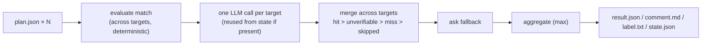

# tfreview — design

A CLI that takes only the result of `terraform plan`, judges what a PR will do to production
against a set of criteria, and posts the result to the PR, plus a GitHub Action that calls it.

## Decisions

| Question | Decision |
| --- | --- |
| Delivery form | CLI is the source of truth. The GitHub Action is a composite action that calls the CLI |
| Running plan | Out of scope. We only consume the output of `terraform show -json` |
| Language | Single Go binary. Module path `github.com/nakamasato/tfreview` |
| Output language | English by default. Config `language:` switches both the comment text and the instruction language sent to the LLM |
| LLM | v1 supports only the Anthropic Messages API. A `Provider` interface keeps the door open for more later |
| Multiple plans | Accepts one or N. The internal model always assumes N |
| Unit name | **target** (the unit of a single `terraform plan` run) |
| Checks | Ship provider-agnostic generic defaults, plus complete AWS / GCP examples under `examples/` |
| Posting to PR | The CLI's `comment` subcommand. Both the Action and local usage call the same command |
| Obtaining plan (local) | The `fetch` subcommand reads the artifact the Action uploaded. Running plan yourself is the agent's own responsibility (nothing bundled for that in v1) |
| Incremental judging | In scope for v1. The CLI only reads/writes the state file; storage is the Action's responsibility |
| Blocking | `--fail-on <level>`. Default is to never fail the build |
| Labels | `tfreview:none` / `tfreview:medium` / `tfreview:high` / `tfreview:critical` / `tfreview:unknown` |
| License | MIT |

## 1. Overview

```
terraform show -json ──▶ tfreview extract ──▶ plan.json (reduced, tagged with a target name)
                                                  │
    .tfreview.yaml ───────────────────────────────┤
    state.json (previous run) ────────────────────┤
                                                  ▼
                                          tfreview review ──▶ result.json / comment.md / label.txt / state.json
                                                  │
                                                  ▼
                                          tfreview comment --pr N   (upsert + label)

tfreview fetch --pr N ──▶ plan.json files  (fetched from the artifact the Action uploaded)
```

Commands hand off to each other through JSON files. Each command can be run and tested in
isolation.

### Subcommands

| Command | Input | Output | External dependency |
| --- | --- | --- | --- |
| `extract` | `--show-json FILE\|-` (output of `terraform show -json`), `--target NAME`, `--out FILE` | plan.json | none |
| `review` | `--plan FILE` (repeatable), `--config FILE`, `--state-in FILE`, `--out-dir DIR`, `--head-sha`, `--repo owner/name`, `--fail-on LEVEL`, `--fail-on-machine-only` | `DIR/result.json`, `DIR/comment.md`, `DIR/label.txt`, `DIR/state.json` | LLM API |
| `comment` | `--result FILE`, `--pr N`, `--repo owner/name` | Upserts the PR comment, swaps the `tfreview:*` label | GitHub API |
| `fetch` | `--pr N`, `--repo owner/name`, `--out-dir DIR` | plan.json files | GitHub API |

`review` exit codes: 0 = normal, 1 = matched the `--fail-on` condition, 2 = invalid config or
invalid input. LLM failures never affect the exit code (they're surfaced in the comment as an
incomplete judgment instead).

### What `extract` keeps

`address` / `type` / `name` / `module_address` / `provider_name` / `actions` / `after` (only
the parts not flagged by `after_sensitive`), plus `changed_keys` (the attribute names whose
value changes in this PR) for update / replace only. **`before` values are never included.**
`counts` holds the per-target number of add / change / destroy / replace / import actions.

```json
{
  "target": "aws-prd",
  "counts": {"add": 1, "change": 2, "destroy": 0, "replace": 0, "import": 0},
  "resources": [
    {
      "address": "aws_s3_bucket.logs",
      "type": "aws_s3_bucket",
      "name": "logs",
      "module_address": "",
      "provider_name": "registry.terraform.io/hashicorp/aws",
      "actions": ["update"],
      "after": {"bucket": "logs", "force_destroy": true},
      "changed_keys": ["force_destroy"]
    }
  ]
}
```

## 2. Config (`.tfreview.yaml`)

```yaml
language: en                 # default en. Controls both the comment's fixed text and the LLM instruction language
llm:
  provider: anthropic        # v1 supports anthropic only
  model: claude-opus-5
  max_plan_chars: 100000     # above this, skip the API call and mark every check unverifiable
  pricing:                   # USD / Mtok. Used only for the footer's cost estimate. Falls back to built-in values if omitted
    input: 5.00
    cache_write: 6.25
    cache_read: 0.50
    output: 25.00
categories:
  - id: destruction
    title: Destruction / downtime
    checks:
      - id: delete-or-replace
        level: critical                    # none < medium < high < critical
        match: { actions: [delete] }       # only actions / types / targets. Values are string lists
        verdict_on_match: ask              # hit (default) / ask / unverifiable
        question: |
          ...
```

- If `categories` is absent, the built-in generic defaults are used. Setting it replaces the
  defaults entirely
- `id` must be unique across both categories and checks. Duplicate ids, an invalid `level`, an
  unknown key under `match`, or a check with neither `question` nor `match` are all a
  ConfigError (exit 2)
- The config's SHA-256 is mixed into the state key as a digest

### Check types

| Type | Config | What it judges | LLM |
| --- | --- | --- | --- |
| A. Fact | `match` (`verdict_on_match: hit`) | A fact directly visible in the plan | Not used |
| B. Interpretation | `question` only | Visible in the plan but needs interpretation | Used |
| B′. Fact + interpretation | `match` + `question` + `verdict_on_match: ask` | What changes is deterministic; whether it's dangerous needs interpretation | Used. Falls back to the match result if no answer comes back |
| C. Unverifiable | `match` + `verdict_on_match: unverifiable` | Something that can never appear in a plan | Not used. Reports "cannot be verified from the plan" |

`level` is always decided by config. The LLM only returns whether a check applies and why.

### Level definitions

The axes are recoverability and production impact.

| level | criterion |
| --- | --- |
| `critical` | Irreversible, or takes production down |
| `high` | Reversible, but damage can continue unnoticed |
| `medium` | Reversible, and the impact is contained |
| `none` | Not applicable |

### Built-in default checks

Kept to what's provider-agnostic.

| category | check | type | level |
| --- | --- | --- | --- |
| destruction | delete-or-replace | B′ (`actions: [delete]` + ask) | critical |
| data-loss | stateful-delete | A (`actions: [delete]` + major DB / storage types) | critical |
| data-loss | guard-relaxed | B (a guard like force_destroy / deletion_protection is loosened) | critical |
| exposure | privilege-grant | B (permission expansion, wildcards) | high |
| exposure | public-exposure | B (0.0.0.0/0, public access) | high |
| cost | recurring-charge | B (an increase in recurring charges) | high |

`examples/aws.yaml` / `examples/gcp.yaml` hold complete examples including provider-specific
checks.

## 3. Judging flow (`review`)



1. Zero plans → a comment saying nothing was evaluated, `tfreview:none`, the LLM is never called
2. Every target has empty resources → a "no diff" comment, `tfreview:none`, the LLM is never called
3. Evaluate `match` for every check across every target. It's deterministic and free, so it
   always runs from scratch
   - `hit` / `unverifiable` are final
   - `ask` only goes to the LLM when there's a candidate; the match result is kept as a fallback
4. For each target, look up state by `(plan digest, config digest)`. Reuse it if present;
   otherwise ask the LLM once with all of that target's undetermined check questions
5. Merge the same check across targets: keep whichever is more dangerous. If the losing side
   was `unverifiable` / `skipped`, that fact is noted briefly in the winner's reason
6. `ask` fallback: if even one target is missing an answer, fall back to the match result (this
   stops a max-merge from letting a missing side be overridden by `miss`). A value that falls
   back this way is treated as a final verdict
7. Aggregation: a category's score is the max of its checks; the PR's score is the max of its
   categories
8. If even one check is `skipped`, the heading reads "incomplete judgment" and the label is
   `tfreview:unknown`
9. `--fail-on LEVEL`: exit 1 if the PR score is at or above LEVEL. With
   `--fail-on-machine-only`, only `hit` results that came from match (type A, or an ask
   fallback) count. `unknown` never fails the build

### Incremental judging (state)

```json
{
  "head_sha": "abc123",
  "config_digest": "sha256:...",
  "targets": {
    "aws-prd": {
      "plan_digest": "sha256:...",
      "verdicts": [{"check_id": "...", "verdict": "hit", "reason": "..."}]
    }
  }
}
```

- The key is the SHA-256 of "the reduced plan JSON + config", scoped per target
- `match` is never cached
- A target that includes a `skipped` result is not written to state (so a transient failure
  doesn't get pinned for the lifetime of the PR)
- If `--state-in` is missing or corrupt, it's ignored and every target is judged from scratch

## 4. Calling the LLM

- `Provider` interface: `Judge(ctx, plan, checks, language) ([]Verdict, Usage, error)`
- **One** Messages API call per target. No agent loop, no tools
- Input: system (role and constraints: don't guess at anything not in the plan, use
  unverifiable when you can't decide, include the resource in the reason) + user (target name,
  plan JSON, list of questions)
- The response is structured output via tool_use:
  `{verdicts: [{check_id, verdict: hit|miss|unverifiable, reason}]}`. Any check that doesn't
  come back is `skipped`
- Prompt caching on system + plan
- If the plan exceeds `max_plan_chars`, skip the call and mark every check `unverifiable`
  (state the size overage explicitly in the reason)
- API error, timeout, or parse failure → every check for that target becomes `skipped`. The
  process itself doesn't fail
- `Usage` accumulates call count and input / cache_write / cache_read / output tokens; the
  footer reports model, call count, tokens, and an estimated cost. Omitted for runs that never
  called the LLM
- A `mock` Provider ships for tests (returns a fixed verdict, or an error)

## 5. Output

### `comment.md`

Top to bottom:

| Section | Content |
| --- | --- |
| Marker | `<!-- tfreview:begin -->` … `<!-- tfreview:end -->` |
| Heading | `## 🔴 Risk: critical — Destruction / downtime`. Severity is readable from the text alone |
| Badges | One overall badge + a `hits/total` badge per category (shields.io). Redundant with the heading on purpose, so it's fine if they don't render |
| Meta | The commit that was judged (short SHA, linked) and the judgment time (`<relative-time>`) |
| Table | Per-category scores, with per-check verdict and reason in the details (🔧 fact from the plan / 🤖 LLM judgment) |
| Target table | Per-target add / change / destroy / replace / import counts, and whether it was reused or re-judged |
| Source-of-truth link | A link to the config file (blob at the judged commit) |
| Footer | Only for runs that called the LLM: model, call count, tokens, estimated cost |

### `result.json`

The comment's source data: `score`, `incomplete`, `label`,
`categories[].checks[].{verdict, reason, source: machine|llm}`, `targets[].counts`, `usage`.
Read by the `comment` subcommand and by external tools.

### `label.txt`

`tfreview:<score>` or `tfreview:unknown`. One line.

## 6. `comment` / `fetch`

- `comment`: searches the PR's comment list for one of ours (identified by the marker); PATCHes
  it if found, POSTs otherwise. Removes every `tfreview:*` label and attaches exactly one.
  Creates a label with a level-specific color if it doesn't exist yet (warns and posts the
  comment only if creation fails). `tfreview:` is a reserved namespace

  | Label | Color |
  | --- | --- |
  | `tfreview:none` | green `0E8A16` |
  | `tfreview:medium` | yellow `FBCA04` |
  | `tfreview:high` | orange `D93F0B` |
  | `tfreview:critical` | red `B60205` |
  | `tfreview:unknown` | blue `0075CA` |

  Colors match the badges (shields.io) one-to-one. Existing label colors are never overwritten
- `fetch`: finds a plan among the runs for the PR's head SHA (successful or failed — the Action
  uploads the artifact before `fail-on` can fail the build). If a `tfreview-plan` artifact
  exists, use it; otherwise inspect every artifact on the run by content (a raw
  `terraform show -json` output, identified by having `format_version`+`resource_changes`, gets
  run through `extract`; an already-reduced plan with `target`/`resources`/`counts` is used as
  is). If no usable plan is found at all, exit 1 and list the artifact names that were found (so
  the agent can decide to run plan itself)
- Auth: the `GITHUB_TOKEN` environment variable, falling back to `gh auth token`

## 7. GitHub Action (`action.yml`)

A composite action. The binary is fetched from a release (the version matches the action's
ref).

| input | description |
| --- | --- |
| `plan-json` | Glob of reduced plan JSON (already run through `extract`). Mutually exclusive with `show-json` |
| `show-json` | Glob of `terraform show -json` output. The target name is taken from the filename, and `extract` runs inside the Action |
| `config` | Default `.tfreview.yaml` |
| `anthropic-api-key` | Required |
| `github-token` | Default `${{ github.token }}`. Needs `pull-requests: write` / `issues: write` |
| `fail-on` | Optional |
| `comment` | Default true. When false, only judges, doesn't post |

- State lives in `actions/cache` (key `tfreview-state-<pr>-<run_id>`, restore-keys
  `tfreview-state-<pr>-`)
- The reduced plan JSON is uploaded as the `tfreview-plan` artifact (what `fetch` reads back)
- `result.json`'s `score` / `label` are exposed as outputs

## 8. Go package layout

```
cmd/tfreview/            main (cobra)
internal/plan/           extract, the Plan / Resource model
internal/config/         schema, validation, digest, built-in defaults
internal/match/          deterministic judging
internal/llm/            Provider interface, Usage, pricing
internal/llm/anthropic/  Messages API implementation
internal/llm/mock/       for tests
internal/judge/          orchestration (§3)
internal/render/         comment.md, result.json, i18n strings
internal/state/          incremental cache
internal/github/         comment upsert, label, artifact fetch
action.yml
examples/aws.yaml, examples/gcp.yaml
testdata/                plan JSON fixtures, golden output
```

## 9. Testing

- `internal/*` gets unit tests (match / aggregate / merge / ask fallback / state / config /
  render)
- `judge` is tested end-to-end with the mock Provider: plan fixtures under `testdata/` →
  golden `comment.md` / `result.json`
- The anthropic implementation only hits the real API when `TFREVIEW_LIVE=1` is set
- The CLI is exercised from `go test` by invoking `main`, running extract → review through to
  the output files

## 10. Out of scope

- Anything that doesn't show up in the plan (workflow files, CODEOWNERS, removal of
  `prevent_destroy`)
- Judging runs against the config on the PR branch — this is not a defense against a malicious
  insider
- The LLM's judgment can be wrong. Read type B / B′ results as inference, not fact

## 11. README structure

1. One-sentence description + a screenshot of the comment
2. Why tfreview (selling points, in this order)
   1. **Plan-only review** — the only input is the result of `terraform plan`. Since no agent
      walks the repo, the judgment is stable and each target costs exactly one API call
   2. **Checks live in config** — what counts as dangerous is defined in YAML, combining
      deterministic judging (match) and LLM judging (question) across 4 types
   3. **Incremental judging** — judgments are reused per target, keyed by a hash of the plan and
      config. Results don't flap between pushes, and you're not billed again for them
   4. **One PR comment + a `tfreview:*` label** — replaced in place, never piled up
   5. **Multiple targets, one judgment** — evaluate a monorepo or multiple environments
      together, keeping whichever side is more dangerous
   6. **Blocking is optional** — posts only by default; `--fail-on` can turn it into a required
      check
   7. **Same judgment locally** — `tfreview fetch --pr` pulls CI's plan down so you can review
      it by hand or from an AI agent
3. Quick start (a few lines of GitHub Action)
4. CLI (the four subcommands)
5. Configuration (schema, the 4 types, level definitions, built-in defaults, examples)
6. How it works (judging flow, degradation, incremental)
7. Limitations
8. License
